# Proyecto 2: Plataforma Analítica E-commerce — Olist Brazil

> Plataforma analítica end-to-end construida sobre Microsoft Fabric con el dataset real **Olist Brazilian E-Commerce** (~100K órdenes, 2016-2018). Implementa **Medallion Architecture multi-Lakehouse** (Bronze / Silver / Gold separados), notebooks **parametrizables** para soportar promoción entre ambientes, modelo dimensional avanzado con **SCD Tipo 2**, **dimensión chatarra (junk)**, **dimensión degenerada**, **dimensiones conformadas** y **role-playing dimension**, modo **Direct Lake on SQL** y dashboard de 4 páginas en Power BI.

**Stack:** Microsoft Fabric · PySpark · Delta Lake · Direct Lake · Power BI · DAX

---

## Contexto

Proyecto construido como pieza central de portfolio para la transición Data Analyst → Analytics Engineer. Objetivo declarado: demostrar comprensión profunda de modelado dimensional y arquitectura de datos empresarial, no solo ejecución de un tutorial.

---

## Conceptos dimensionales demostrados

| Concepto | Dónde se aplica |
|---|---|
| **SCD Tipo 2** | `dim_customer` con `valid_from`, `valid_to`, `is_current` y `attribute_hash` |
| **Junk Dimension** | `dim_order_junk` agrupa 5 atributos categóricos pequeños |
| **Degenerate Dimension** | `order_id`, `order_item_id`, `review_id` viven en facts sin tabla propia |
| **Conformed Dimension** | `dim_customer` y `dim_date` compartidas por `fact_order_items` y `fact_reviews` |
| **Role-playing Dimension** | `dim_date` referenciada como `date_sk_purchase` (activa) y `date_sk_delivered` (inactiva) |

Definiciones completas y rationale técnico en [`conceptos-dimensionales.md`](./conceptos-dimensionales.md).

---

## Arquitectura

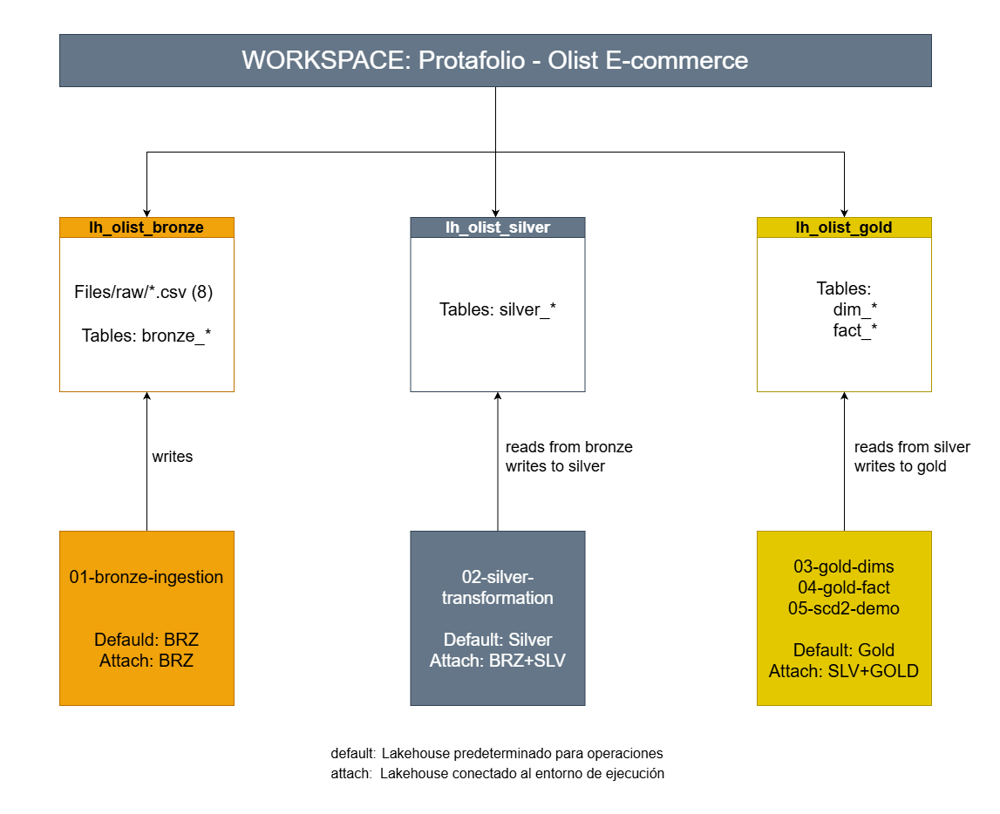

### Multi-Lakehouse separados

| Lakehouse | Contenido | SQL Endpoint propio |
|---|---|---|
| `lh_olist_bronze` | `Files/raw/` con CSVs + 8 tablas `bronze_*` | ✅ |
| `lh_olist_silver` | 7 tablas `silver_*` (limpiezas + casteos) | ✅ |
| `lh_olist_gold` | 5 dimensiones + 2 facts del modelo estrella | ✅ |

### Flujo de datos

```
CSVs (Files/raw/)
   │
   ▼ Notebook 01: 01-bronze-ingestion
   │
   bronze_* (8 tablas Delta)
   │
   ▼ Notebook 02: 02-silver-transformation
   │
   silver_* (7 tablas Delta — products + translation (categoria) se combinan)
   │
   ▼ Notebook 03: 03-gold-dimensions
   │
   dim_* (5 dimensiones)
   │
   ▼ Notebook 04: 04-gold-facts
   │
   fact_order_items, fact_reviews
   │
   ▼ Modelo semántico sm_olist_gold (Direct Lake on SQL)
   │
   ▼ Dashboard Power BI (4 páginas)
```

---

## Estructura del repositorio

```
Proyecto-2-olist-medallion/
├── README.md                              # Este documento
├── Diagrama-arquitectura.PNG              # Diagrama multi-Lakehouse
├── conceptos-dimensionales.md             # Definiciones de los 5 conceptos
├── modelo-estrella.md                     # Diccionario de columnas del modelo
├── dax-measures.md                        # Medidas DAX documentadas
├── validacion-gold.sql                    # Queries de validación de integridad
├── config_environment-parameters.md       # Parámetros por ambiente
│
├── notebooks/
│   ├── 01-bronze-ingestion.ipynb          # Ingesta CSV → Bronze
│   ├── 02-silver-transformation.ipynb     # Limpieza, casteos → Silver
│   ├── 03-gold-dimensions.ipynb           # 5 dimensiones (SCD1, SCD2, junk)
│   └── 04-gold-facts.ipynb                # 2 facts con lookups SCD2-aware
│
├── dataset/
│   └── README.md                          # Fuente, licencia e instrucciones de descarga
│
└── capturas/
    └── *.PNG                              # 24 screenshots del proceso
```

---

## Dataset Olist

Tomado de [Brazilian E-Commerce Public Dataset by Olist](https://www.kaggle.com/datasets/olistbr/brazilian-ecommerce) — Kaggle. ~100K órdenes reales con clientes, productos, vendedores, pagos y reviews entre 2016 y 2018.

**Tablas utilizadas (8 de 9):**

| Archivo | Filas | Uso |
|---|---|---|
| `olist_customers_dataset.csv` | 99,441 | Clientes con city/state/zip |
| `olist_orders_dataset.csv` | 99,441 | Órdenes con timestamps |
| `olist_order_items_dataset.csv` | 112,650 | Ítems por orden |
| `olist_order_payments_dataset.csv` | 103,886 | Pagos por orden |
| `olist_order_reviews_dataset.csv` | 99,224 | Reviews (1-5 estrellas) |
| `olist_products_dataset.csv` | 32,951 | Productos con categoría y dimensiones físicas |
| `olist_sellers_dataset.csv` | 3,095 | Vendedores con city/state |
| `product_category_name_translation.csv` | 71 | Lookup PT → EN de categorías |

**Excluido:** `olist_geolocation_dataset.csv` (1M filas, decisión de scope — no aporta a los conceptos demostrados).

Detalle de licencia en [`dataset/README.md`](./dataset/README.md).

---

## Resultados

### Setup multi-Lakehouse

Tres Lakehouses separados creados en el workspace, uno por capa de la arquitectura Medallion.

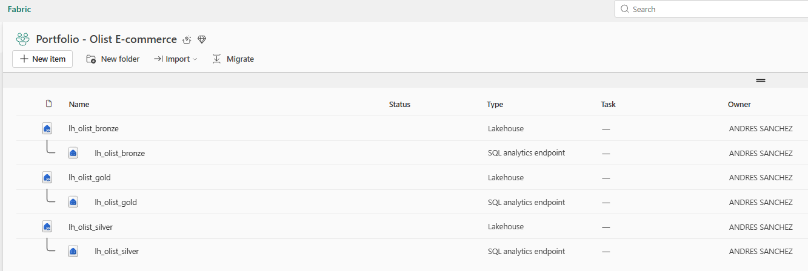

### Bronze — Ingesta cruda

Los 8 CSVs ingestados como tablas Delta en `lh_olist_bronze`, con conteos validados contra los rangos esperados de Olist.

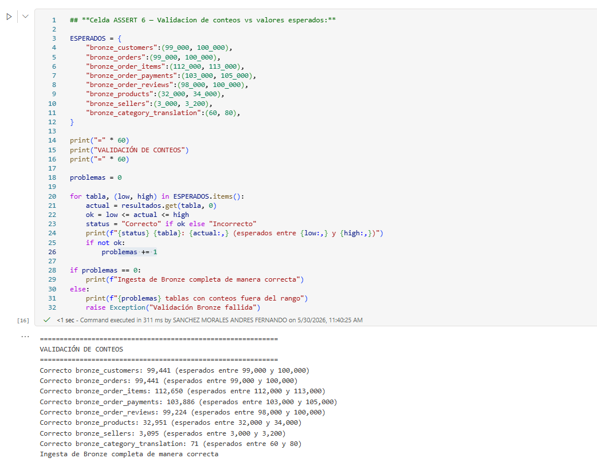

### Silver — Limpieza y casting

7 tablas `silver_*` resultantes (products + translation se combinan vía join). Validación de PK explícita por tabla.

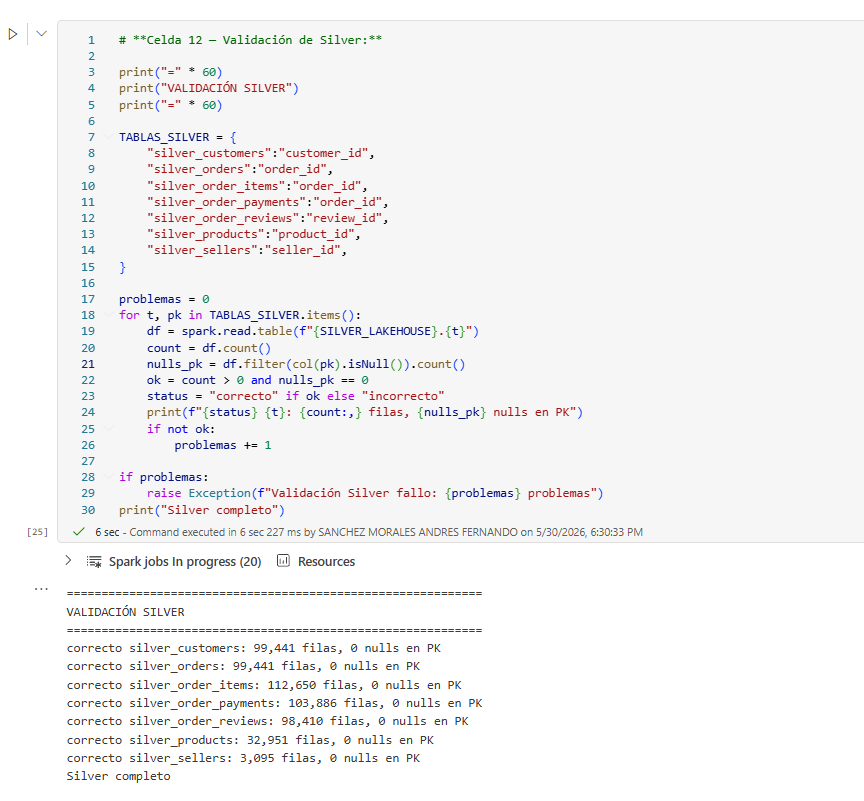

### Gold — Modelo dimensional

#### SCD Tipo 2 funcionando

Historia completa de un cliente con múltiples versiones detectadas (cambios reales de city/state entre órdenes).

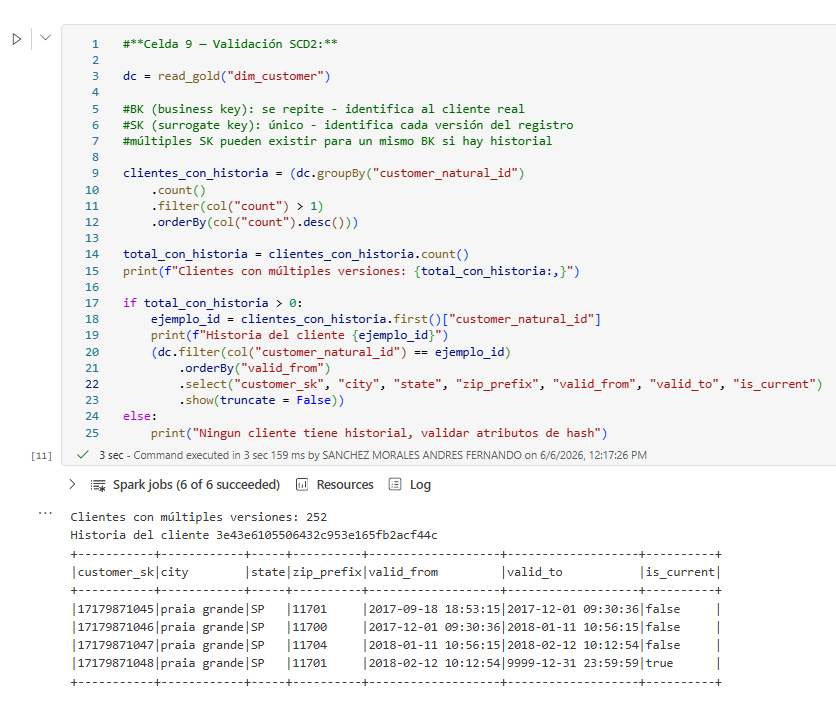

#### Junk Dimension

107 combinaciones únicas observadas en los datos (vs ~1024 del producto cartesiano teórico).

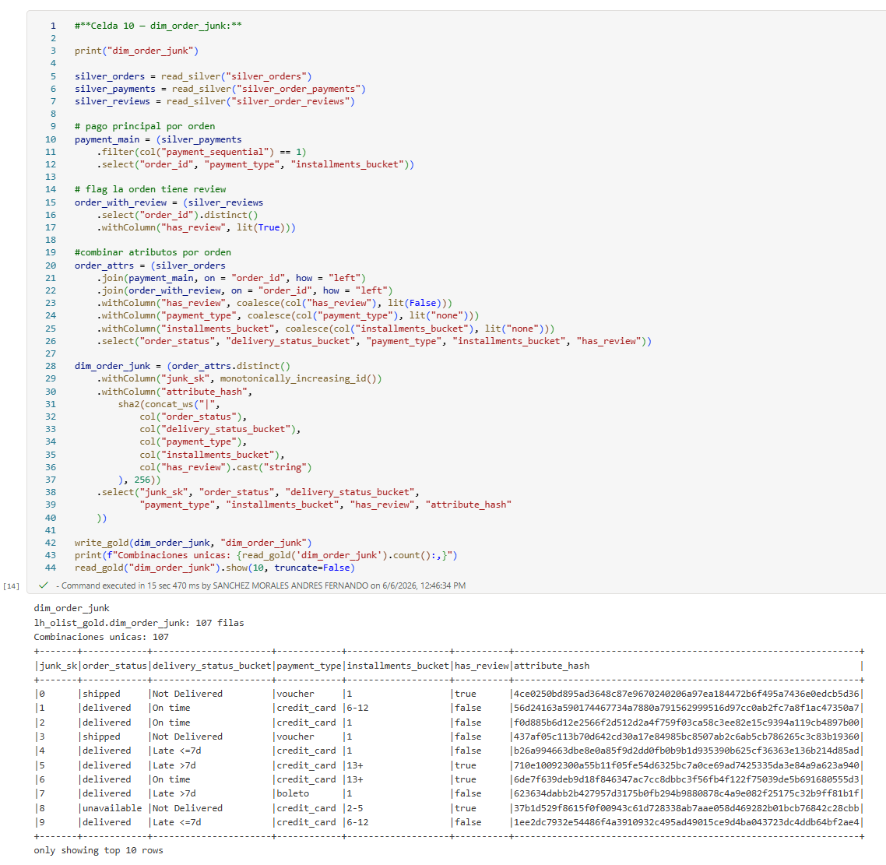

#### Lookup SCD2-aware en facts

Asignación del `customer_sk` correcto a cada hecho usando rango temporal `valid_from ≤ event_timestamp < valid_to`.

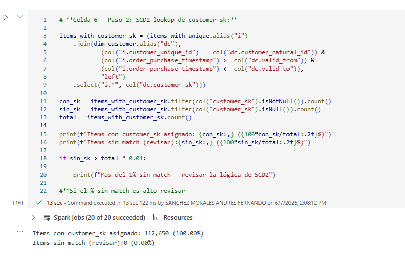

#### Integridad referencial de facts

Validación de huérfanos en ambos facts con umbral tolerable del 0.1%.

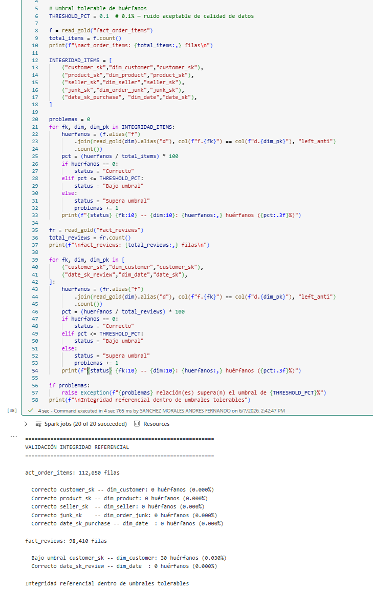

#### Modelo Gold completo

5 dimensiones + 2 facts persistidos en `lh_olist_gold`.

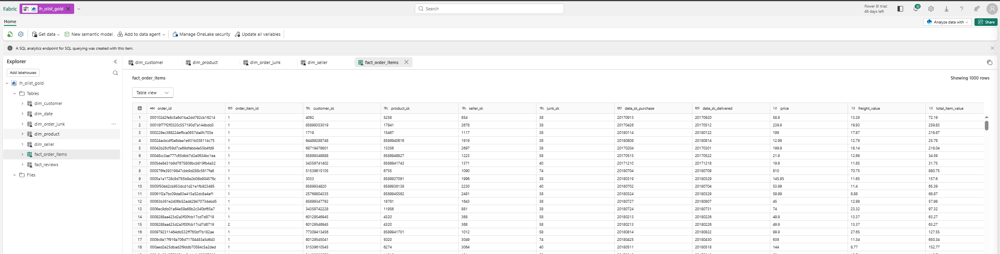

### Modelo semántico

#### Relaciones del modelo estrella

Incluye la relación inactiva entre `fact_order_items[date_sk_delivered]` y `dim_date[date_sk]` (role-playing dimension activada con `USERELATIONSHIP` en DAX).

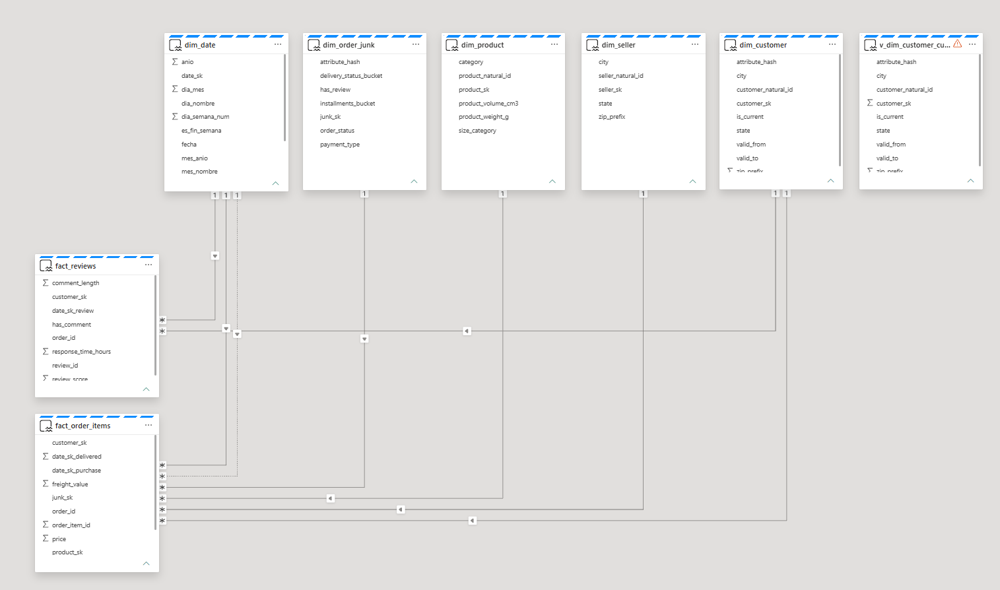

#### Medidas DAX

Medidas organizadas en 5 grupos (ventas, temporales, role-playing, reviews, cross-fact).

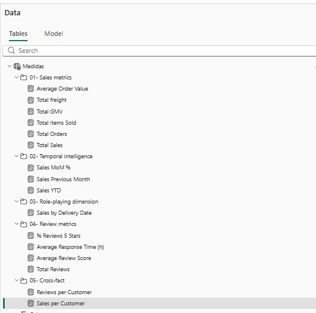

### Dashboard final

Cuatro páginas que explotan cada concepto dimensional implementado.

| Página | Foco | Captura |
|---|---|---|
| 1 — Resumen ejecutivo | KPIs generales, tendencia temporal | 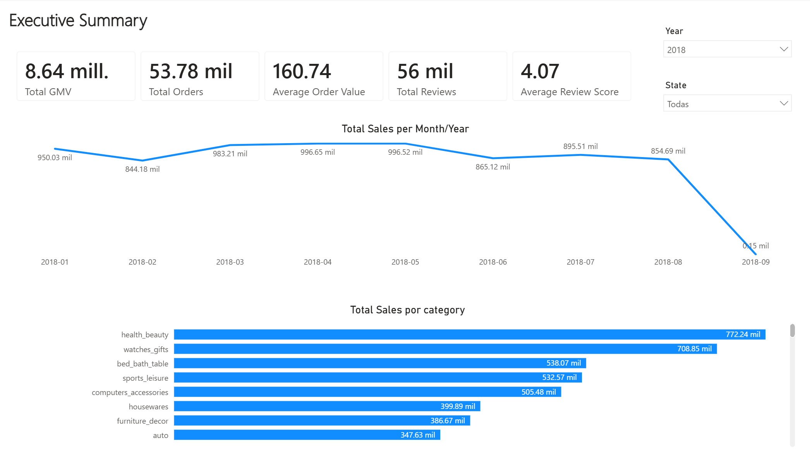 |
| 2 — Clientes | Dimensión conformada en acción (ventas + reviews por estado) | 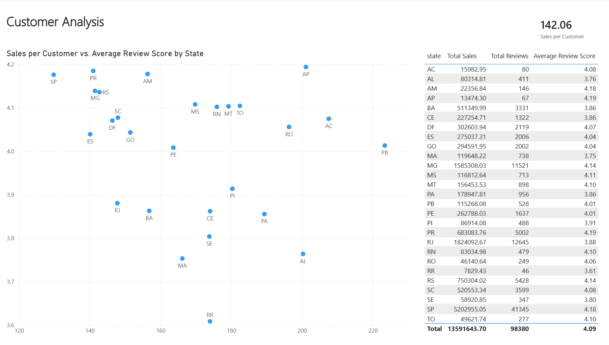 |
| 3 — Operacional | Junk dimension explotada (payment, installments, delivery) | 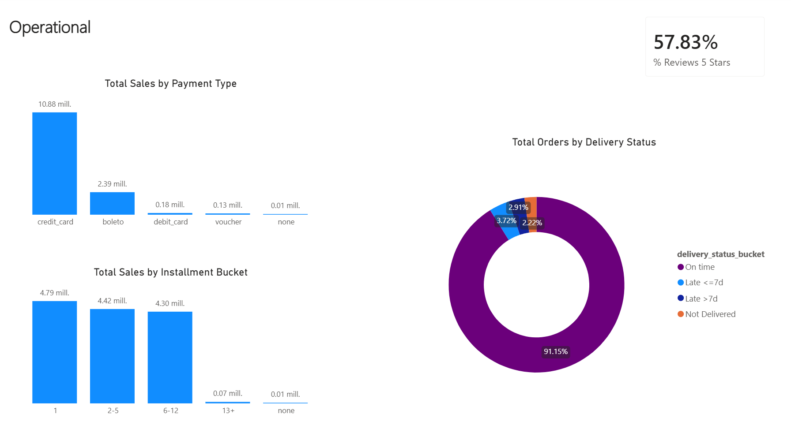 |
| 4 — SCD2 viewer | Clientes con múltiples versiones históricas | 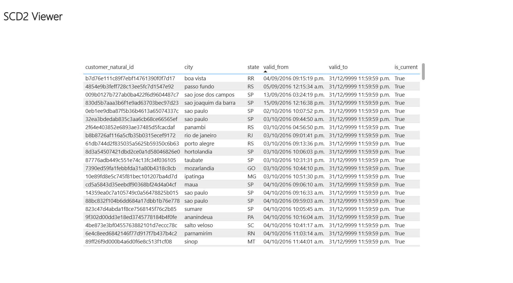 |

> Todas las capturas del proceso (24 en total) están disponibles en [`capturas/`](./capturas/).

---

## Cómo reproducir

### Pre-requisitos
- Workspace de Microsoft Fabric con capacidad asignada (Trial sirve).
- Permisos para crear Lakehouses, notebooks, modelos semánticos y reportes.

### Pasos

1. **Crear los 3 Lakehouses** en el workspace (sin marcar "Lakehouse schemas Preview"):
   - `lh_olist_bronze`
   - `lh_olist_silver`
   - `lh_olist_gold`

2. **Subir los CSVs** de `dataset/` a `lh_olist_bronze/Files/raw/`. Excluir geolocation si lo tienes localmente.

3. **Importar los notebooks** en orden y ejecutarlos:

   | Notebook | Default Lakehouse | Lakehouses adjuntos |
   |---|---|---|
   | `01-bronze-ingestion` | `lh_olist_bronze` | solo el default |
   | `02-silver-transformation` | `lh_olist_silver` | + `lh_olist_bronze` |
   | `03-gold-dimensions` | `lh_olist_gold` | + `lh_olist_silver` |
   | `04-gold-facts` | `lh_olist_gold` | + `lh_olist_silver` |

   Cada notebook tiene una **parameters cell** con defaults para dev; ver
   [`config_environment-parameters.md`](./config_environment-parameters.md) para
   override en otros ambientes.

4. **Crear vista para customer current** en el SQL Endpoint de `lh_olist_gold`:
   ```sql
   CREATE VIEW v_dim_customer_current AS
   SELECT * FROM dim_customer WHERE is_current = True;
   ```

5. **Crear modelo semántico** `sm_olist_gold` con storage mode **Direct Lake on SQL** sobre las 7 tablas Gold. Agregar la vista posteriormente como tabla DirectQuery dentro del modelo compuesto. Relaciones según [`modelo-estrella.md`](./modelo-estrella.md).

6. **Crear medidas DAX** según [`dax-measures.md`](./dax-measures.md).

7. **Construir dashboard** de 4 páginas (capturas `21-page1.PNG` a `24-page4.PNG` como referencia visual).

---

## Decisiones técnicas

### 1. Multi-Lakehouse separados (3) vs Lakehouse único con prefijos

**Decisión:** 3 Lakehouses independientes (`lh_olist_bronze`, `lh_olist_silver`, `lh_olist_gold`).

**Rationale:**
- Cada capa tiene su propio SQL Endpoint y permisos potenciales (un analista podría tener acceso solo a Gold).
- Patrón común en deployments productivos de Fabric.

**Trade-off aceptado:** los notebooks deben adjuntar múltiples Lakehouses y usar nombres calificados (`spark.read.table(f"{LAKEHOUSE}.tabla")`). Más verboso pero más explícito.

### 2. Notebooks parametrizados

**Decisión:** parameters cell en todos los notebooks con `LAKEHOUSE`, `WRITE_MODE`, `RAW_FILES_PATH`.

**Rationale:** soporta promoción dev → test → prod con el mismo código. Un Data Pipeline puede invocar el notebook sobre-escribiendo parámetros.

### 3. Storage mode: Direct Lake on SQL (modelo compuesto)

**Decisión:** Direct Lake on SQL, con la vista `v_dim_customer_current` agregada como DirectQuery dentro del modelo compuesto.

**Rationale:**
- **Madurez:** Direct Lake on SQL está GA (Disponibilidad General). Direct Lake on OneLake sigue en public preview.
- **Soporte de SQL views:** el diseño requiere la vista `v_dim_customer_current` para filtrar la versión vigente del SCD2 sin caer en tablas calculadas DAX (que romperían Direct Lake completo). Direct Lake on OneLake no soporta SQL views.
- **Multi-source no aplica:** la ventaja diferencial de OneLake (consumir tablas de múltiples Fabric items) no se aprovecha — el modelo consume exclusivamente `lh_olist_gold`.

**Trade-off aceptado:** queries sobre `v_dim_customer_current` ejecutan en DirectQuery, con costo de latencia mayor. Aceptable para el volumen del proyecto y se limita a slicers, no a medidas masivas.

### 4. SCD2 con detección por hash

**Decisión:** uso `sha2(concat_ws("|", city, state, zip), 256)` para detectar cambios en `dim_customer`.

**Rationale:** escala mejor que comparar columna por columna. Si en el futuro se agregan atributos al tracking, basta incluirlos en el hash.

### 5. Calendario continuo vs fechas de eventos

**Decisión:** `dim_date` cubre el rango completo desde `MIN(order_purchase)` hasta `MAX(review_creation)`, no solo días con actividad.

**Rationale:** las funciones de inteligencia temporal de DAX (`DATESYTD`, `PREVIOUSMONTH`) requieren un calendario sin huecos para retornar valores correctos.

### 6. Vista SQL para "customer current" en lugar de tabla calculada DAX

**Decisión:** `CREATE VIEW v_dim_customer_current AS SELECT * FROM dim_customer WHERE is_current = True;`

**Rationale:** tablas calculadas en DAX rompen Direct Lake y fuerzan fallback a DirectQuery globalmente. Una vista SQL mantiene Direct Lake operativo para el resto del modelo y solo la vista cae en DirectQuery localmente.

### 7. Junk dimension con combinaciones reales (no producto cartesiano)

**Decisión:** `dim_order_junk` enumera solo las combinaciones que aparecen en los datos (107), no el producto cartesiano teórico de los 5 atributos (~1024).

**Rationale:** reduce la cardinalidad de la dim sin perder información (las combinaciones imposibles nunca aparecerían en el fact). Detalle conceptual en [`conceptos-dimensionales.md`](./conceptos-dimensionales.md).

---

## Hallazgos de calidad de datos

Durante la construcción se identificaron dos anomalías del dataset fuente que se manejan explícitamente:

### 1. Productos sin categoría (610 filas, 1.85%)

Olist tiene ~610 productos donde `product_category_name` es NULL en el sistema fuente. El pipeline maneja esto en Silver:

```python
.withColumn("product_category_name",
    coalesce(col("product_category_name"), lit("unknown")))
.withColumn("product_category_name_english",
    coalesce(col("product_category_name_english"), lit("unknown")))
```

Resultado en Gold: `dim_product[category] = "unknown"` para esos productos. **No se descartan** — siguen siendo parte del análisis bajo una categoría explícita.

### 2. Reviews sin match SCD2 en fact_reviews (30 filas, 0.03%)

Tras investigación de cadena de joins (review → order → customer → dim_customer), se identificaron 30 reviews donde `review_creation_date` es **anterior** al `order_purchase_timestamp` de la orden asociada. Causa raíz: inconsistencias de timestamp en el sistema fuente (probablemente timezone mismatches o registros desincronizados entre microservicios de Olist).

Estos reviews fallan el lookup SCD2 temporal porque su `review_creation_date < valid_from` de la primera versión del cliente.

**Manejo:** umbral tolerable del 0.1% en la validación de integridad referencial. Los 30 (0.03%) están bajo umbral y se aceptan documentándolos.

```python
THRESHOLD_PCT = 0.1  # bajo este % se acepta como ruido sistémico
```

Este patrón de "umbrales tolerables" es estándar en producción real — la perfección de calidad de datos no existe, y diseñar pipelines con tolerancias razonables es parte del oficio.

---

## Limitaciones conocidas

- **`monotonically_increasing_id()` para surrogate keys:** puede colisionar entre cargas si se ejecuta múltiples veces. Aceptable para overwrite mode (cada ejecución es atómica), no para append/MERGE. En producción real se usaría una secuencia explícita o UUID.
- **Sin tests unitarios formales:** las validaciones son asserts simples al final de cada notebook. Mejorable con `chispa`, `pydeequ` o Great Expectations.
- **Sin carga incremental real:** todos los notebooks usan `mode("overwrite")`. La promoción a `append` o `MERGE` requiere agregar lógica de detección de cambios.
- **`geolocation` excluido:** decisión de scope. Limita análisis geográfico fino más allá de city/state.
- **Sin particionado de fact_order_items:** ~112K filas no lo justifican, pero a escala productiva se particionaría por `anio_mes` o `date_sk_purchase`.

---

## Aprendizajes técnicos

Documentados en orden de "lo que más me costó":

1. **Spark mueve la columna de un join a posición 0** cuando se usa la sintaxis `on="columna"`. Es comportamiento USING-style. Defensa: agregar `.select(...)` explícito después de cada join para fijar el contrato de columnas.

2. **Diferencia entre `customer_id` (uno por orden) y `customer_unique_id` (uno por persona)** en Olist. Esta separación que parece rara al inicio es exactamente el alimento de SCD2: cada `customer_id` lleva la "instantánea" del cliente en el momento de su orden.

3. **Direct Lake puede caer silenciosamente a DirectQuery** cuando se usan SQL views, tablas calculadas DAX, o ciertas funciones. La herramienta de diagnóstico del modelo lo identifica.

4. **Relaciones inactivas + `USERELATIONSHIP()`** para role-playing dimensions sin duplicar `dim_date`.

5. **Validar contra una PK explícita, no contra `df.columns[0]`.** Joins reorganizan columnas; una validación que asume posición es frágil.

6. **Investigar antes de tirar datos.** Los 30 huérfanos en `fact_reviews` se podían filtrar silenciosamente. El ejercicio de rastreo (eslabón 1 → 2 → 3) reveló que el sistema fuente tiene ruido temporal que merece documentación, no ocultamiento.

---

## Mejoras posibles

- **Surrogate keys con secuencia explícita o UUID** en lugar de `monotonically_increasing_id()`.
- **Tests de calidad de datos automáticos** con `pydeequ` o Great Expectations (rangos de valores, unicidad, completitud).
- **Carga incremental real en Silver** usando `MERGE INTO` de Delta con detección de cambios por hash.
- **Particionado de `fact_order_items` por `anio_mes`** para escalabilidad futura.
- **SCD Tipo 2 también en `dim_seller`** si interesara trackear cambios de ubicación de vendedores.
- **Reescritura como proyecto dbt** o como pipelines de Fabric orquestados con dependencias declaradas.
- **Integración con Microsoft Purview** para lineage automático y catalogación.

---

## Licencia

- **Código:** libre uso con atribución.
- **Dataset Olist:** publicado bajo [CC BY-NC-SA 4.0](https://creativecommons.org/licenses/by-nc-sa/4.0/) por Olist. Uso no comercial. Más detalle en [`dataset/README.md`](./dataset/README.md).

---

## Autor

Andrés F. Sánchez — Data Analyst transicionando a Analytics Engineer.
Proyecto construido como pieza de portfolio para certificación DP-600 (Microsoft Fabric Analytics Engineer Associate) y demostración de modelado dimensional avanzado.
